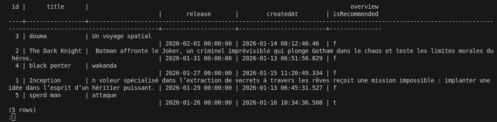
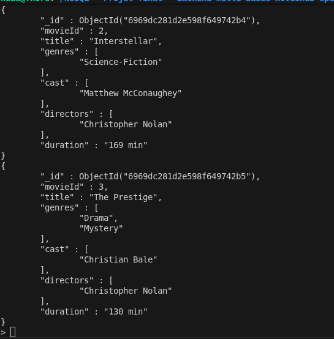
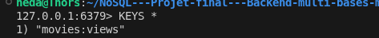

# Document d’architecture – MovieHub API

## 1. Présentation générale du projet

**MovieHub API** est une API backend permettant de gérer une base de films, d’enrichir ces films avec des métadonnées avancées, de proposer des recommandations et d’optimiser les performances via un système de cache.

L’architecture repose sur une approche **polyglotte**, combinant trois types de bases de données :

- **PostgreSQL** : stockage relationnel structuré  
- **MongoDB** : stockage flexible des métadonnées  
- **Redis** : cache haute performance et popularité  

*Objectif pédagogique : démontrer la complémentarité entre bases relationnelles et NoSQL.*

---

## 2. Architecture globale

```
Client (curl / frontend)
        |
        v
   API Node.js (Express)
        |
        |-- PostgreSQL (films)
        |-- MongoDB (détails & recommandations)
        |-- Redis (cache / popularité)
```

L’ensemble est orchestré via **Docker Compose**, garantissant un environnement reproductible et portable.

*
---

## 3. Base relationnelle – PostgreSQL

### 3.1 Rôle

PostgreSQL stocke les données principales et critiques :

- titre  
- résumé  
- date de sortie  
- cohérence métier  
- contraintes d’intégrité  

Ces données nécessitent un schéma strict et des transactions 

### 3.2 Schéma relationnel

Table : **movies**

| Champ     | Type          | Description          |
|-----------|---------------|----------------------|
| id        | INTEGER (PK)  | Identifiant unique   |
| title     | TEXT          | Titre du film        |
| overview  | TEXT          | Résumé               |
| release   | DATE          | Date de sortie       |
| createdAt | TIMESTAMP     | Date de création     |



### 3.3 Justification du choix PostgreSQL

- Transactions **ACID**  
- Intégrité référentielle  
- Idéal pour données critiques et structurées  
- Requêtes SQL puissantes  

---

## 4. Base NoSQL – MongoDB

### 4.1 Rôle

MongoDB stocke les données **flexibles**, **évolutives** et **hétérogènes** :

- casting  
- réalisateurs  
- genres  
- langues  
- images  
- métadonnées de recommandation  

Ces données varient fortement d’un film à l’autre → parfait pour un modèle NoSQL.

### 4.2 Modèle MongoDB (`MovieDetails`)


### 4.3 Justification du choix MongoDB

- Schéma flexible (ajout de champs sans migration)  
- Adapté aux données hétérogènes  
- Stockage naturel des tableaux (cast, genres, langues)  
- Requêtes documentaires efficaces  

---

## 5. Base NoSQL – Redis

### 5.1 Rôle

Redis est utilisé comme :

- **cache** pour accélérer les réponses  
- **compteur de popularité** (vues par film)  
- **stockage clé-valeur temporaire**  

Exemples :




### 5.2 Justification du choix Redis

- Stockage **en mémoire** → ultra rapide  
- Idéal pour données temporaires  
- Réduit la charge sur PostgreSQL  
- Parfait pour compteurs et classements  

---

## 6. Endpoints principaux

| Endpoint                          | Base utilisée      | Rôle |
|----------------------------------|---------------------|------|
| GET /movies                      | PostgreSQL          | Liste des films |
| POST /movies                     | PostgreSQL          | Création d’un film |
| POST /movies/:id/details         | MongoDB             | Ajout de métadonnées |
| GET /movies/:id/details          | MongoDB             | Récupération des détails |
| GET /movies/popular              | Redis + PostgreSQL  | Films les plus populaires |


---

## 7. Conclusion

MovieHub API démontre une architecture moderne et efficace :

- PostgreSQL → données critiques et structurées  
- MongoDB → métadonnées flexibles  
- Redis → performance et popularité  

Cette combinaison permet une API performante, évolutive et adaptée à des besoins variés.

